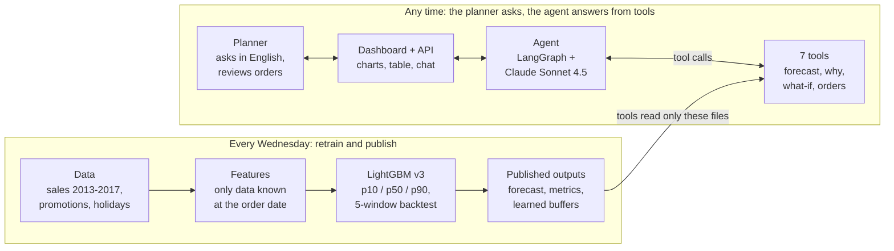

# FreshFlow: an AI planning agent for food-distributor demand forecasting

Sep 27, 2026

FreshFlow forecasts the next 7 days of demand for 702 store-category series and turns it into replenishment decisions a planner can question in plain English. In a day-by-day replay with real demand it cuts stock-out, waste and holding cost by 51% ($4.62M to $2.28M a year) versus today's rule of thumb.

## The need and our answer

Planners order hundreds of food products from last period's sales and experience. Seasonality, promotions and shifting buying patterns are judged by gut feel, so perishables are over-ordered and thrown away while staples run out.

FreshFlow puts a planning agent on top of a forecasting model that has been tested on past data:

| Step | What happens | Component |
| --- | --- | --- |
| Forecast | Every Wednesday, forecast the next 7 days for every store and category, with an 80% range (p10 to p90) | LightGBM v3 |
| Decide | Order for the next delivery = forecast x (1 + a per-category buffer learned from backtests) - stock on hand | Replenishment tool |
| Explain and explore | Planners ask: forecast? why? stock-out risk? how much to order? which categories first? what if we cancel the promotion? | LangGraph agent with Claude Sonnet 4.5 |
| Stay trustworthy | Every number in an answer must come from a tool result; otherwise a labelled template answer is shown. The agent never places orders | Fact checks in the agent |

## How it works

The model runs offline once a week and publishes its results as files. The agent can only answer through tools that read those files, so every number a planner sees traces back to the model. Each number in an answer is checked against tool results; otherwise a labelled template is shown.

## Domain and assumptions

We modelled a regional fresh-food distributor supplying 54 supermarkets in Ecuador across 13 food categories: 702 store-category demand series. Fresh categories are delivered daily or every 2-3 days, dry goods weekly, and orders are planned every Wednesday.

- **Historical replay.** Sales data ends 2017-08-15; the week 2017-08-16 to 08-22 is treated as next week.
- **Promotions are planned ahead.** The number of items on promotion per category and day is known when ordering, as in a retailer's promotion calendar.
- **Category, not SKU.** Forecasts are per store and product category; the pipeline extends to SKUs unchanged.
- **Operations are simulated.** Stock on hand, shelf life, lead time, delivery frequency, MOQ, cost and price are not in the data. They are stated as assumptions in the product and in every agent answer.

## Data: real vs simulated

Demand signals are real; operating parameters are mock data we set per category.

| Real: Kaggle Favorita Store Sales | Simulated: our assumptions |
| --- | --- |
| 1.18M daily food sales rows, 2013-2017 | Stock on hand = 1.5 days of recent sales |
| Items on promotion per store, category and day | Sellable days: bread and prepared food 1, seafood 2, produce 3, meats 3-4, dairy 7, dry goods 60-120 |
| National, regional and local holidays; store city and type | Delivery interval: daily for fresh food up to weekly for dry goods |
| Promotion plan for the forecast week | Unit cost and price per category (about 30% gross margin), holding cost 25% a year, MOQ |

Cleaning deletes no sales rows. Store 52 opened in April 2017, so its 13 series are treated as a cold start rather than dropped.

## Forecasting method and why

FreshFlow v3 averages **11.7% WAPE** over four regular backtest windows, against 19.9% for last week's same day, 16.3% for the planner rule and 15.3% for our previous model.

- **One global LightGBM** learns across all 702 series: it shares signal between busy and sparse series and trains in about 2 minutes on a 2-vCPU server.
- **Direct 7-day design.** Features use only sales known on the order date, and the model never feeds its own forecasts back in. A unit test changes all future sales and checks that no feature moves.
- **Features for the three causes named in the brief.** Seasonality: weekday, month, paydays, store-matched holidays and days to or from them. Promotions: planned promotion count, 7- and 14-day intensity, deviation from the usual level. Changing buying patterns: last day, 7/14/28/56-day means, trend and volatility, plus weekly retraining.
- **Tweedie objective** for skewed sales (lower error than L1); **quantile models** give the p10 to p90 range, which covered 77% of actuals against an 80% target.

Backtest error (WAPE of 7-day forecasts; each window retrained on data before it, 4 weekly forecasts per window):

| Window | Last week same day | Planner rule (4-week avg) | Model v2 | **FreshFlow v3** |
| --- | --- | --- | --- | --- |
| Apr 2016, earthquake (stress test) | 32.9% | 23.9% | 21.4% | **21.3%** |
| Dec 2016, Christmas | 24.5% | 21.6% | 19.4% | **15.4%** |
| Feb 2017, Carnival | 20.0% | 16.0% | 16.2% | **11.3%** |
| May 2017 | 18.7% | 14.0% | 12.1% | **10.0%** |
| Jul 2017 | 16.3% | 13.7% | 13.4% | **10.1%** |
| **Mean of the 4 regular windows** | 19.9% | 16.3% | 15.3% | **11.7%** |

v3 is weakest on holidays (16.8% WAPE, under-forecast by 7%) and on low-volume categories; the agent flags these for planner review. Decisions we tested rather than assumed:

- A cold-start rule for the new store beat the model on its series (17.4% vs 22.1% WAPE), so new stores use it.
- TSB for intermittent demand did not beat the model (90.0% vs 87.5% WAPE on sparse rows), so it was dropped.
- Promotion counts instead of yes/no flags helped only slightly (12.3% vs 12.4%).
- A quantile-based order rule did not beat p50 plus a learned buffer, so the simpler rule was kept.

## The agent

The agent answers planning questions only through tools, and every answer is checked against what the tools returned before a planner sees it.

| Tool | Answers |
| --- | --- |
| get_forecast | 7-day forecast with its p10 to p90 range for a store and category |
| get_forecast_overview | Totals by category and the biggest changes vs last week |
| explain_forecast | Why: last week vs the 4-week average, the promotion plan, top model drivers |
| what_if_promotion | Re-scores the model with a changed promotion plan |
| get_model_reliability | Backtest accuracy and bias, overall and by situation |
| get_replenishment | Order for the next delivery, stock-out and waste risk |
| get_priority_replenishments | Which categories a store should replenish first |

- **Model and loop.** LangGraph with Claude Sonnet 4.5 through the AWS LLM gateway, using a text-JSON tool protocol because the gateway ignores native tool calling.
- **Fact checks.** Numbers, dates, risk levels and required disclosures (historical data, simulated inventory, no order placed) must match the tool results. A failed check shows a labelled template built from the same results. In live tests, forecast, risk, order, why and what-if answers passed 15 of 15 times; the priority ranking passed 4 of 5.
- **Conversation.** Follow-ups keep the store and category ("Is there a stock-out risk?"). Without enough information it asks instead of guessing. On the dashboard, the selected row sets the context.
- **Human in the loop.** The agent recommends; it never places an order.

## Business value

Replaying 84 days of real demand through the same replenishment process, FreshFlow cuts total cost from $4.62M to $2.28M a year (-51%) while raising the fill rate.

The replay covers 689 established series in 53 stores and three backtest windows. Selling is first-in-first-out, stock spoils after its sellable days, and unmet demand is lost. Each category's safety buffer is learned from the previous window, with the same rule for every method.

| Policy (per year, 53 stores) | Fill rate | Share spoiled | Total cost: lost margin + waste + holding |
| --- | --- | --- | --- |
| Current practice: planner rule + fixed 20% buffer | 99.08% | 1.07% | $4.62M |
| Planner rule + learned buffer | 99.14% | 0.24% | $2.89M |
| Previous model v2 + learned buffer | 99.00% | 0.16% | $2.67M |
| **FreshFlow v3 + learned buffer** | **99.30%** | **0.19%** | **$2.28M** |

- **Where the $2.34M comes from:** $1.73M from category-specific buffers instead of a flat 20% (the decision layer), and $0.61M (-21%) from forecast accuracy alone.
- **Less waste, fewer stock-outs:** spoiled units fall 82% and lost-sales units 23%. Bread goes from 18% of deliveries spoiled to 3.7%, prepared foods from 21% to 4.8%.
- **Same policy in the product:** the agent and dashboard use these buffers for the live week.

Prices, shelf lives and delivery intervals are assumptions (see Data), and perfect first-in-first-out handling understates real waste, so the percentages matter more than the dollar amounts.

## Risks and next steps

The main risk is that simulated operations differ from a real distributor's; the next step is to replace them with real feeds.

| Risk or gap | Next step |
| --- | --- |
| Stock, lead times and prices are simulated | Connect inventory, supplier and price feeds; the policy code is already parameterised |
| Holidays are under-forecast by 7% | Add holiday-specific features and flag holiday weeks for planner review |
| Demand shocks (the 2016 earthquake) are not predictable | Drift monitoring and weekly retraining (one command today) |
| Planner experience is not captured | Log planner overrides with reasons and measure whether they improve accuracy |
| Category level, not SKU | Run the same pipeline per SKU; the cold-start and intermittent routes are ready |

## Demo and sources

- **Live demo:** [FreshFlow dashboard](https://56-10-18-105.sslip.io) on AWS Lightsail. Try: "Give me the seven-day forecast for PRODUCE at Store 1.", "Is there a stockout risk?", "How many units should I order?", "Which categories should Store 3 replenish first?"
- **Model card:** [MODEL_CARD.md](../MODEL_CARD.md), with backtest windows, error by situation and limitations
- **Business value:** [BUSINESS_VALUE.md](../BUSINESS_VALUE.md), with the replay method and all cost assumptions
- **Demo script:** [DEMO_SCRIPT.md](DEMO_SCRIPT.md)
- **Data:** [Kaggle Store Sales - Time Series Forecasting (Favorita)](https://www.kaggle.com/competitions/store-sales-time-series-forecasting)
